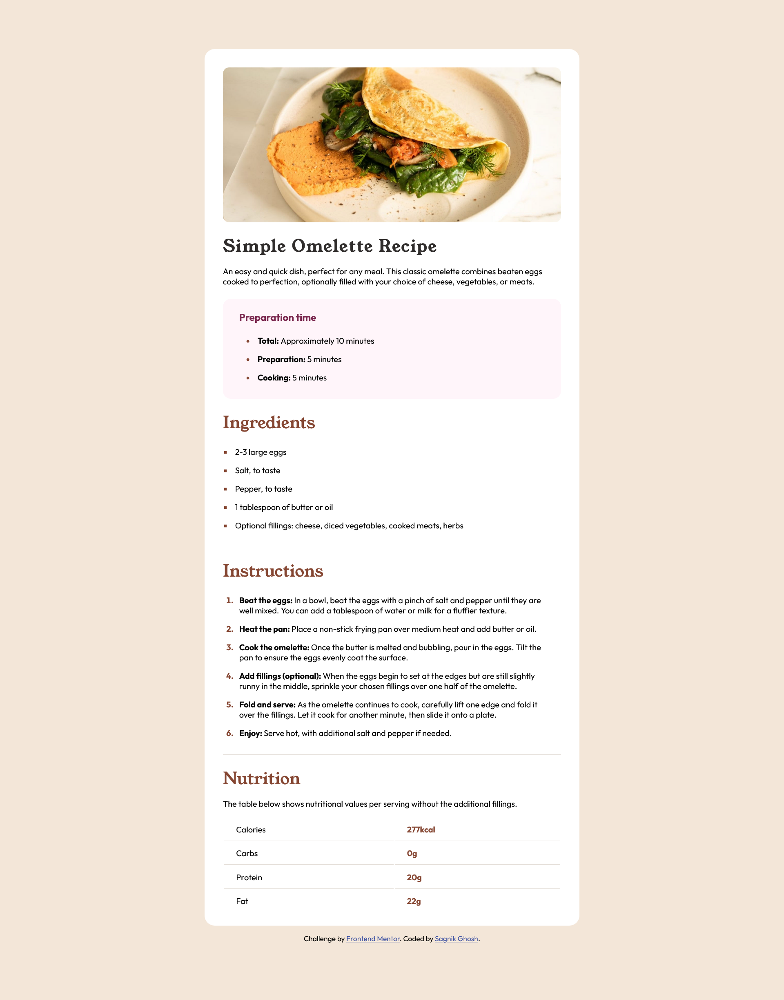

# Frontend Mentor - Recipe page solution

This is a solution to the [Recipe page challenge on Frontend Mentor](https://www.frontendmentor.io/challenges/recipe-page-KiTsR8QQKm). Frontend Mentor challenges help you improve your coding skills by building realistic projects.

## Table of contents

- [Overview](#overview)
  - [Screenshot](#screenshot)
  - [Links](#links)
- [My process](#my-process)
  - [Built with](#built-with)
  - [What I learned](#what-i-learned)
- [Author](#author)

## Overview

### Screenshot

### Links

- Solution URL: [Github | Recipe page](https://github.com/sagnikghosh1999/recipe-page)
- Live Site URL: [live site](https://sagnikghosh1999.github.io/recipe-page)

## My process

### Built with

- Semantic HTML5 markup
- CSS custom properties
- Flexbox
- CSS Grid
- Mobile-first workflow

### What I learned

This Challenge made me have a better understanding of marker and list-sty type along with tables.

## Author

- Website - [Sagnik Ghosh](https://sagnik-ghosh.vercel.app)
- Frontend Mentor - [@sagnikghosh1999](https://www.frontendmentor.io/profile/sagnikghosh1999)
- Github - [@sagnikghosh1999](https://github.com/sagnikghosh1999)
